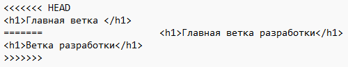
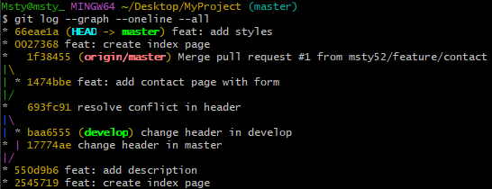
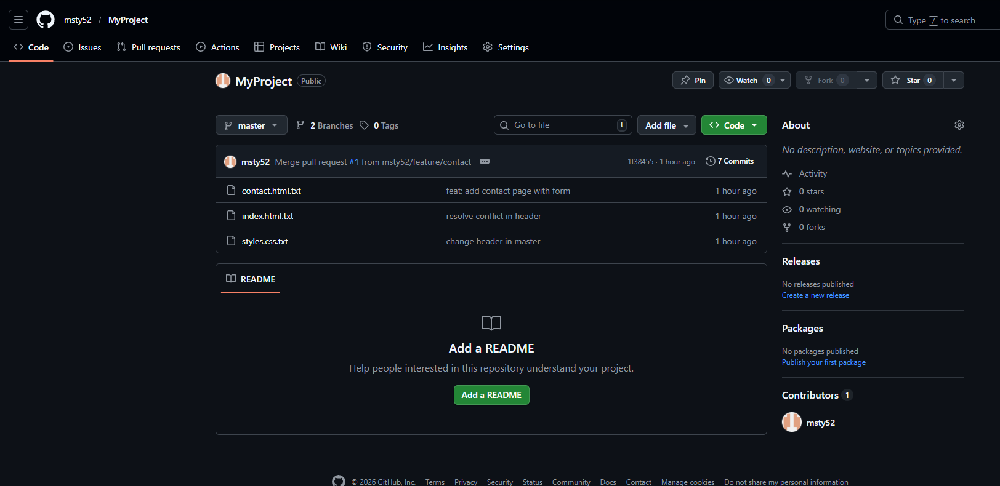

Отчет о вкладе в проект  
1. Задача
В рамках коллективной разработки мне была поручена задача по созданию информационной страницы контактов для проекта MyProject.

 2. Выполненные действия
* Клонирование: Склонировал основной репозиторий в локальную папку FriendProject.
* Создание ветки: Для изоляции кода создал новую ветку feature/contact.
* Разработка: Создал файл contact.html с базовой разметкой и информацией.
* Публикация: Отправил изменения на удаленный сервер GitHub.
* Pull Request:для проверки кода основным разработчиком.

## 3. Результат
Мои изменения были успешно одобрены и влиты в основную ветку master. Теперь страница контактов доступна в общем репозитории.

### Скриншоты подтверждения:

